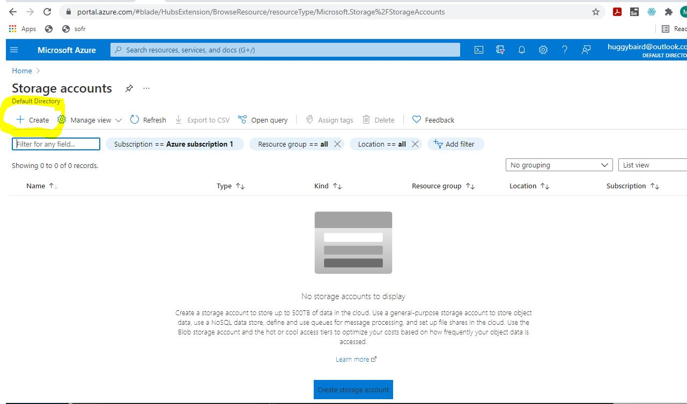

# Azure Blob Extract

## Table of Contents
* [Overview](#overview)
* [Installation & Setup](#installation-and-setup)
* [TODO's](#todos)
* [Verify Installation is Running](#verify-installation-is-running)

--------------------------------------------------------
<a name="overview"></a>
# Overview
This project uses an Azure Function to extract tar/zip files from an Azure Blob. 

## cool... right?

--------------------------------------------------------
<a name="PreRequisites"></a>
# PreRequisites
* A Microsoft Azure Account - https://azure.microsoft.com/en-us/free/
* Visual Studio Code - https://code.visualstudio.com/
* Pythnon 3.8 (or newer) - https://www.python.org/downloads/
* Git - https://git-scm.com/downloads 

--------------------------------------------------------
<a name="installation-and-setup"></a>
# Installation & Setup
TODO: Here, we walk through step by step how to get this working.   
## Create an Azure Blob Storage Account
At the power shell 
```bash
 todo:
```
Or, if you don't want to use power shell, you can also use Azure Portal:


## Create A Python Function 
TODO: 
## Deploy the Python Function to Azure
TODO:
## Configure a Blob Event Trigger that Calls the Extract Function
TODO:
## Test it works by dropping a zip or tar file


--------------------------------------------------------
<a name="todos"></a>
# TODO's

##  Enable logging of access
##  Use Azure Keyvault to secure Blob
##  

--------------------------------------------------------
<a name="Known Limitations"></a>
# Known Limitations
* Zip/Tar file size of 2GB on free tier storage. this is a limitation of the Azure Function 


 


